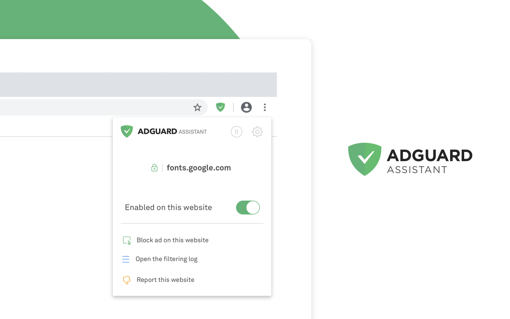

# AdGuard Browser Assistant

  Companion extension for the AdGuard desktop app — manage filtering
  right from the browser and hide annoying elements in two clicks.

  

## Description

AdGuard Browser Assistant is for users of the AdGuard desktop app
(Windows/Mac) who want to see and control filtering without leaving the
browser. Checking whether a site is filtered, allowlisting it, or
reporting a missed ad otherwise means opening the desktop app — the
extension puts those controls into the browser toolbar instead.

The extension does not filter traffic by itself: the desktop app does
the filtering, and the extension is its browser-side companion UI. It
shows the filtering status of the current tab and lets you toggle
protection, pause filtering, block elements manually, and report
websites in a couple of clicks.

This is a replacement for the [legacy assistant](https://github.com/AdguardTeam/AdguardAssistant)
userscript we were using before that.

## Table of Contents

- [Installation](#installation)
- [Quick Start](#quick-start)
- [Features](#features)
- [Permissions](#permissions)
- [FAQ / Troubleshooting](#faq--troubleshooting)
- [Browser compatibility](#browser-compatibility)
- [Acknowledgments](#acknowledgments)
- [Documentation](#documentation)

## Installation

**Important:** this extension requires the AdGuard desktop app to
function. Install AdGuard for Mac or Windows first, then use this
extension to expand the app's capabilities.

1. Install AdGuard for [Windows or Mac](https://adguard.com/).
2. Install the extension from your browser's web store — links for
   Chrome, Firefox, Edge, and Opera are on the
   [product page](https://adguard.com/en/adguard-assistant/overview.html).
3. After installation, confirm the consent agreement on the post-install
   page.

## Quick Start

1. Make sure the AdGuard desktop app is installed and running.
2. Click the AdGuard Browser Assistant icon in the browser toolbar.
3. The popup shows the filtering status of the current tab. From here
   you can toggle protection for the site, block an element, or pause
   filtering — the extension is active right away.

## Features

### Toolbar popup

- View the filtering status of the current tab: protection state,
  number of blocked ads, and HTTPS filtering/certificate details.
- Enable or disable filtering on the current website.
- Pause all filtering for 30 seconds.
- Remove all user rules for the current page in one click.
- Jump to the desktop app's filtering log or settings for this page.

### Element blocking

- Launch the Assistant overlay from the popup or the context menu,
  select any annoying element on the page (text, image, video, banner),
  and remove it. A user filter rule is created automatically.

### Website reporting

- Report a website (e.g. when an ad snuck through) directly from the
  popup or the context menu.

### Context menu

- Right-click a page to enable/disable filtering on this website, block
  ads on it, report an issue, pause/resume AdGuard protection, or open
  AdGuard settings and the filtering log.
- The context menu integration can be turned off on the extension's
  options page.

## Permissions

| Permission | Reason |
| --- | --- |
| `nativeMessaging` | Communicate with the AdGuard desktop app (native host) |
| `tabs` | Indicate website filtering status by changing the icon color |
| `activeTab` | Show filtering status and stats for the current tab |
| `scripting` | Inject the element-blocking Assistant overlay into the page |
| `contextMenus` | Add filtering actions to the page context menu |
| `storage` | Save extension settings and the consent agreement |

## FAQ / Troubleshooting

**The popup says "AdGuard is not installed or configured incorrectly".**
Install the AdGuard desktop app for
[Windows or Mac](https://adguard.com/) and make sure it is running.

**The popup says "AdGuard is not running" or "AdGuard is not updated".**
Launch the desktop app, or update it to the latest version — the
extension needs a compatible app version to talk to.

**The icon or menu says "AdGuard cannot run on this domain".**
Some pages — browser internal pages, other extensions' pages, web
stores — are inaccessible to extensions, so filtering status and
controls are unavailable there.

**Why isn't HTTPS filtered on my bank's website?**
By default, HTTPS traffic of payment systems and banks is not filtered.
You can enable filtering for such a site yourself: click the yellow
"lock" icon in the popup.

**The popup says "Trial has expired".**
Filtering is disabled until the AdGuard license is renewed or purchased
in the desktop app.

## Browser compatibility

<!-- NOTE: keep in sync with MIN_SUPPORTED_VERSION in ./constants.js -->

| Browser | Version |
| --- | --- |
| Chromium-based browsers | ✅ 88 |
| Firefox | ✅ 109 |
| Opera | ✅ 74 |

## Acknowledgments

This software wouldn't have been possible without:

- [React](https://github.com/facebook/react)
- [MobX](https://github.com/mobxjs/mobx)
- and many more npm packages.

For a full list of all `npm` packages in use, please take a look at
[package.json](package.json) file.

## Documentation

- [Development](DEVELOPMENT.md) — build, test, and local release workflows
- [Deployment](DEPLOYMENT.md) — GitHub Actions CI/CD and store publish
- [Changelog](CHANGELOG.md) — version history
- [Firefox beta](FIREFOX_BETA.md) — install link for Firefox beta XPI
- [LLM agent rules](AGENTS.md) — AI-assisted development guidelines
